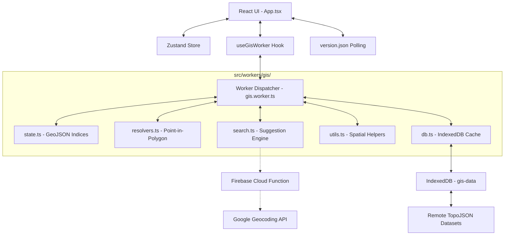

# System Architecture

NammaMap V2 is designed for high-performance GIS rendering in the browser, focusing on low latency and minimal data overhead.

## 🏗️ High-Level Overview

### 1. The GIS Worker (Background Engine)
To prevent UI jank, all heavy lifting happens in the background. The worker was recently modularized for better maintainability:

*   **Modular Architecture**: Located in `src/workers/gis/`, the engine is decoupled into specialized modules:
    *   `state.ts`: Centralizes shared GeoJSON data and `RBush` spatial indices.
    *   `resolvers.ts`: Handles coordinate-to-boundary resolution (Pincodes, Local Bodies, Constituencies).
    *   `search.ts`: Orchestrates the recommendation engine for the global search bar.
    *   `db.ts`: Manages the low-level IndexedDB transactions and retry logic.
    *   `utils.ts`: Contains pure spatial helpers and normalization logic.
*   **Spatial Indexing**: Uses `RBush` for high-speed spatial searches (O(log n)) instead of linear scans.
*   **Caching Layer**: Implements a 24-hour IndexedDB cache (store name: `gis-data`). All remote data fetches are persisted locally to ensure sub-second loads on subsequent visits.
*   **Property Thinning**: Automatically strips unnecessary metadata from GeoJSON features before sending them to the main thread, reducing message serialization overhead.
*   **Global Geocoding Fallback**: If local civic data indexes fail to match a search query, the worker triggers an external fetch to a Firebase Cloud Function proxy, securely resolving coordinates via the Google Maps Geocoding API.

### 2. State Management (The Source of Truth)
We use **Zustand** for lightweight, performant state.
*   **Context Isolation**: The `activeLayer` dictates how the Search Bar and Click Handlers behave.
*   **Selection Persistence**: The map remembers your area highlight even when switching service tabs.
*   **Global Resolver**: A platform-wide coordinate input system (`globalLocation`) that supports manual Lat/Lng, Google Maps URL extraction, and address string geocoding, allowing users to jump to any location across all modules.

### 3. Data Strategy (Efficiency)
*   **TopoJSON Compression**: We use TopoJSON instead of raw GeoJSON, reducing file sizes by up to 80% through shared topology and quantization.
*   **Update Notification**: A polling system in `App.tsx` compares the local `APP_VERSION` with a server-side `version.json` every 5 minutes. To ensure a smooth UX, dismissed update notifications are persisted in `localStorage`, preventing redundant prompts for the same version within a user session.

### 4. Internationalization (i18n)
We use a custom, lightweight translation system built for speed and low bundle size.
*   **Centralized Dictionary**: `translations.ts` acts as the single source of truth for all UI strings in English and Tamil.
*   **`useTranslation` Hook**: Components consume a custom hook that provides a type-safe `t()` function, automatically reacting to language changes in the Zustand store.
*   **Visual Parity Engine**: A dynamic CSS scaling system in `index.css` (via `.lang-ta`) compensates for the naturally larger character size of Tamil text, ensuring the UI remains balanced across both languages.

## 🛠️ Data Layers

| Layer | Source | Format | Strategy |
| :--- | :--- | :--- | :--- |
| **Districts** | TN State GIS | TopoJSON | Pre-loaded on init |
| **Pincodes** | India Post | TopoJSON | Pre-loaded on init |
| **PDS** | Civil Supplies | JSON | Lazy-loaded by District |
| **TNEB** | TANGEDCO | TopoJSON | Lazy-loaded by District |
| **Health** | Health Dept | JSON | On-demand (Manifest driven) |
| **Police** | Home Dept | TopoJSON | Lazy-loaded by District |
| **Constituency** | Election Comm | TopoJSON | Pre-loaded on activation |
| **Local Bodies** | RDMA | TopoJSON | Lazy-loaded by District (VPs) |

## 🔒 Performance & Security Rules
1.  **No Main-Thread Loops**: Any iteration over >1000 features must happen in the worker.
2.  **No Redundant Renders**: Map styles are memoized to prevent re-drawing the entire world on state changes.
3.  **Asset Quantization**: All coordinates are quantized to 5 decimal places to balance precision and file size.
4.  **Backend Proxy for Secrets**: Sensitive API keys (like Google Maps) MUST NOT be exposed in the frontend bundle. They are proxied through Firebase Cloud Functions and managed via Firebase Secret Manager.

## 🧪 Local Development (Emulator)
To test Global Search locally, you must run the Firebase Functions emulator:
1. Ensure `GOOGLE_MAPS_API_KEY` is present in `functions/.env`.
2. Run `firebase emulators:start`.
3. The map worker automatically detects `localhost` and routes requests to the local emulator port (5001).
