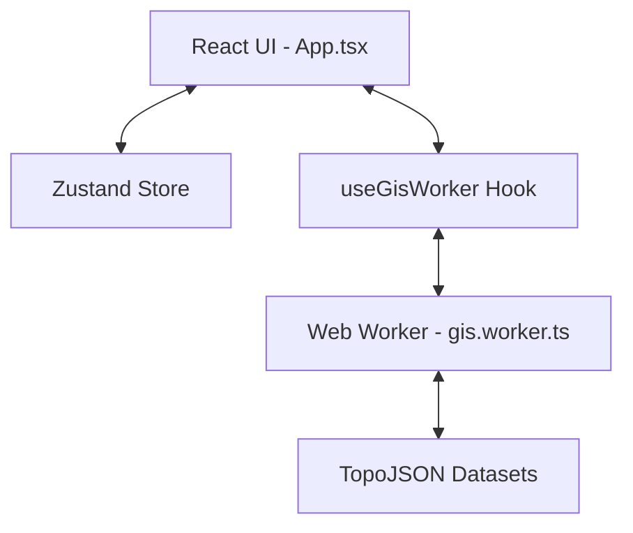

# System Architecture

NammaMap V2 is designed for high-performance GIS rendering in the browser, focusing on low latency and minimal data overhead.

## 🏗️ High-Level Overview

### 1. The GIS Worker (Background Engine)
To prevent UI jank, all heavy lifting happens in `gis.worker.ts`.
*   **Spatial Indexing**: Loads and parses TopoJSON files off-thread.
*   **Resolution Engine**: Performs point-in-polygon checks using a ray-casting algorithm.
*   **Lazy Loading**: Only fetches district-specific PDS data when the user selects a region.

### 2. State Management (The Source of Truth)
We use **Zustand** for lightweight, performant state.
*   **Context Isolation**: The `activeLayer` dictates how the Search Bar and Click Handlers behave.
*   **Selection Persistence**: The map remembers your area highlight even when switching service tabs.

### 3. Data Strategy (Efficiency)
*   **TopoJSON Compression**: We use TopoJSON instead of raw GeoJSON, reducing file sizes by up to 80% through shared topology and quantization.
*   **Global-to-Local**: We avoid loading the entire state's point data. Instead, we use a global boundary index to trigger targeted loading of local datasets.

## 🛠️ Data Layers

| Layer | Source | Format | Strategy |
| :--- | :--- | :--- | :--- |
| **Districts** | TN State GIS | TopoJSON | Pre-loaded on init |
| **Pincodes** | India Post | TopoJSON | Pre-loaded on init |
| **PDS** | Civil Supplies | JSON | Lazy-loaded by District |
| **TNEB** | TANGEDCO | TopoJSON | Loaded on TNEB layer activation |

## 🔒 Performance Rules
1.  **No Main-Thread Loops**: Any iteration over >1000 features must happen in the worker.
2.  **No Redundant Renders**: Map styles are memoized to prevent re-drawing the entire world on state changes.
3.  **Asset Quantization**: All coordinates are quantized to 5 decimal places to balance precision and file size.
