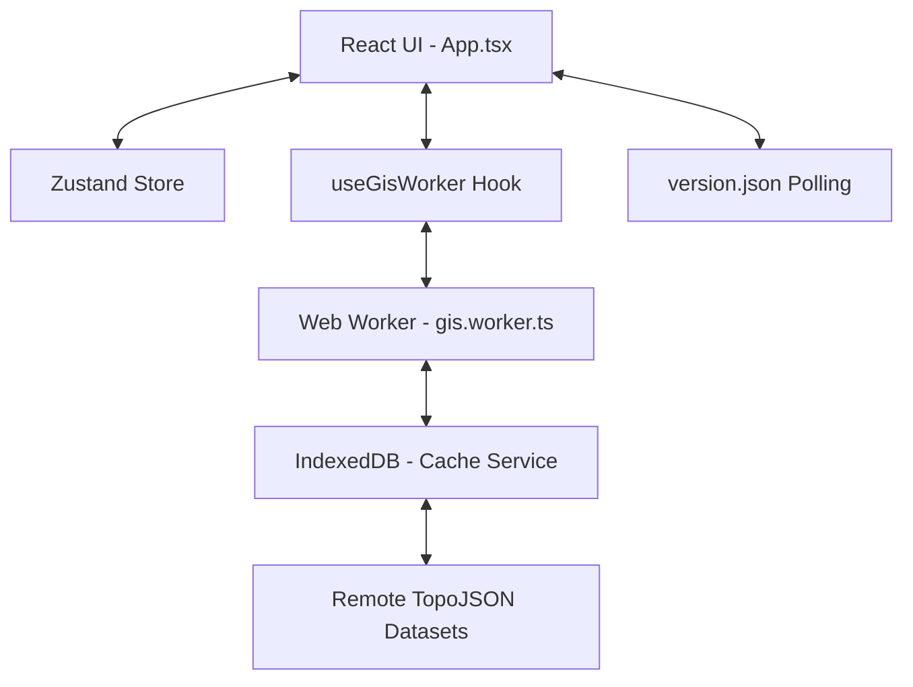

# System Architecture

NammaMap V2 is designed for high-performance GIS rendering in the browser, focusing on low latency and minimal data overhead.

## 🏗️ High-Level Overview

### 1. The GIS Worker (Background Engine)
To prevent UI jank, all heavy lifting happens in `gis.worker.ts`.
*   **Spatial Indexing**: Uses `RBush` for high-speed spatial searches (O(log n)) instead of linear scans.
*   **Caching Layer**: Implements a 24-hour IndexedDB cache via `cacheService.ts`. All remote data fetches are persisted locally to ensure sub-second loads on subsequent visits.
*   **Property Thinning**: Automatically strips unnecessary metadata from GeoJSON features before sending them to the main thread, reducing message serialization overhead.

### 2. State Management (The Source of Truth)
We use **Zustand** for lightweight, performant state.
*   **Context Isolation**: The `activeLayer` dictates how the Search Bar and Click Handlers behave.
*   **Selection Persistence**: The map remembers your area highlight even when switching service tabs.
*   **Global Resolver**: A platform-wide coordinate input system (`globalLocation`) that supports manual Lat/Lng and Google Maps URL extraction, allowing users to jump to any location across all modules.

### 3. Data Strategy (Efficiency)
*   **TopoJSON Compression**: We use TopoJSON instead of raw GeoJSON, reducing file sizes by up to 80% through shared topology and quantization.
*   **Update Notification**: A polling system in `App.tsx` compares the local `APP_VERSION` with a server-side `version.json` every 5 minutes, prompting users to refresh when new builds are deployed.

### 4. Internationalization (i18n)
We use a custom, lightweight translation system built for speed and low bundle size.
*   **Centralized Dictionary**: `translations.ts` acts as the single source of truth for all UI strings in English and Tamil.
*   **`useTranslation` Hook**: Components consume a custom hook that provides a type-safe `t()` function, automatically reacting to language changes in the Zustand store.
*   **Visual Parity Engine**: A dynamic CSS scaling system in `index.css` (via `.lang-ta`) compensates for the naturally larger character size of Tamil text, ensuring the UI remains balanced across both languages.

## 🛠️ Data Layers

| Layer | Source | Format | Strategy |
| :--- | :--- | :--- | :--- |
| **Districts** | TN State GIS | TopoJSON | Pre-loaded on init |
| **Pincodes** | India Post | TopoJSON | Pre-loaded on init |
| **PDS** | Civil Supplies | JSON | Lazy-loaded by District |
| **TNEB** | TANGEDCO | TopoJSON | Lazy-loaded by District |
| **Health** | Health Dept | JSON | On-demand (Manifest driven) |
| **Police** | Home Dept | TopoJSON | Lazy-loaded by District |
| **Constituency** | Election Comm | TopoJSON | Pre-loaded on activation |
| **Local Bodies** | RDMA | TopoJSON | Lazy-loaded by District (VPs) |

## 🔒 Performance Rules
1.  **No Main-Thread Loops**: Any iteration over >1000 features must happen in the worker.
2.  **No Redundant Renders**: Map styles are memoized to prevent re-drawing the entire world on state changes.
3.  **Asset Quantization**: All coordinates are quantized to 5 decimal places to balance precision and file size.
