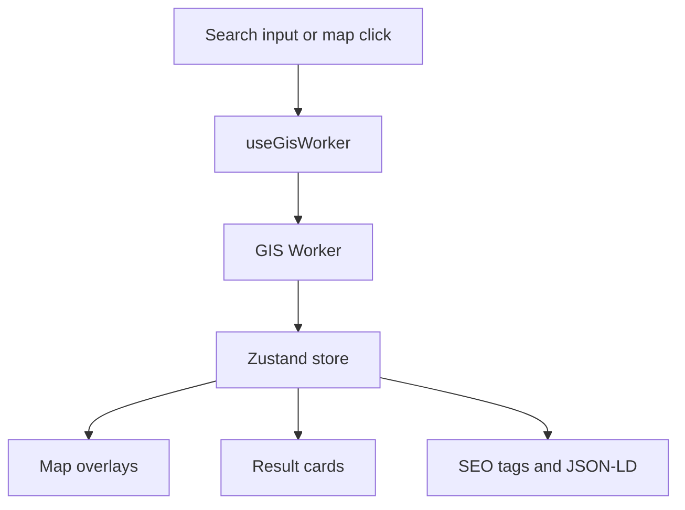

# Codebase Documentation

## Folder-by-Folder Guide

| Folder | Purpose |
|---|---|
| `src/components/` | Shared UI shells, modals, SEO script injection, route management, and global overlays |
| `src/components/layout/` | Search bar, sidebar, map skeleton, result container |
| `src/features/map/` | Leaflet map rendering and user location marker |
| `src/features/health/` | Health filters, prompts, and summary cards |
| `src/features/postal/` | Postal legend/filter helpers |
| `src/features/local_bodies_v2/` | Local body result card for unified civic discovery |
| `src/features/tutorial/` | First-run walkthrough driven by `driver.js` |
| `src/hooks/` | Worker integration and dataset loading hooks |
| `src/i18n/` | Translation table and district language mapping |
| `src/lib/` | Firebase client initialization and analytics helpers |
| `src/services/` | Browser-side caching utilities |
| `src/store/` | Zustand application state |
| `src/types/` | Shared GIS, health, police, postal, and local-body types |
| `src/utils/` | URL parsing, sharing, version formatting, postal labels |
| `src/utils/resolvers/` | Chennai police resolver special case and tests |
| `src/workers/` | GIS worker, the heavy search and resolution engine |
| `public/data/` | Static GIS datasets consumed by the worker |
| `functions/` | Firebase Cloud Functions for geocoding |

## Key Modules

### `src/store/useMapStore.ts`

The Zustand store is the central state layer. It stores:

- Active layer and district
- Search query, suggestions, and selected result
- PDS, postal, police, TNEB, health, and local-body results
- Map view, theme, language, and tutorial state
- Report and legal modal state

Notable patterns:

- `setActiveLayer` clears most layer-specific selections
- `setSearchResult` optionally preserves existing selections
- `clearSearch` resets the current working context
- Analytics events are emitted from store actions such as layer and theme changes

### `src/hooks/useGisWorker.ts`

This hook owns the Web Worker lifecycle. It:

- Creates the module worker
- Sends load and resolve commands
- Receives results and updates the store
- Handles health filtering and district-specific loading
- Captures worker errors with Sentry

### `src/workers/gis.worker.ts`

This is the heaviest file in the project. It:

- Loads and caches static GIS files
- Converts TopoJSON to GeoJSON
- Builds RBush spatial indexes
- Resolves search suggestions
- Resolves locations for each layer
- Applies postal outlier detection
- Handles special police matching, including Chennai-specific logic

### `src/features/map/GisMap.tsx`

The map component renders:

- Leaflet tiles
- GeoJSON overlays
- Clustered markers
- User location markers
- Layer-specific iconography and selection markers

It also contains the map controller that flies to bounds when the search result or jurisdiction changes.

### `src/components/layout/SearchBar.tsx`

SearchBar manages:

- Debounced suggestions
- Keyboard navigation
- Search analytics events
- Layer-specific placeholder text

### `src/components/layout/ResultContainer.tsx`

ResultContainer decides which result card to show based on the active layer and the current selection. It also injects layer-specific JSON-LD into the page.

### `src/components/SchemaData.tsx`

Injects structured data for:

- `WebSite`
- `GovernmentService`
- `Dataset`

## State Management and Data Flow

The store is the single source of truth for UI state, while the worker is the single source of truth for GIS resolution.

## Error Handling Patterns

- `ErrorBoundary` wraps the map so rendering errors can be recovered with a reload.
- The worker catches load and resolution failures and posts `ERROR` messages.
- Geolocation failures use browser `alert` messages as a fallback.
- Version polling and service worker refresh logic fall back to a hard reload if needed.

## Reusable Utilities

| File | Purpose |
|---|---|
| `src/utils/urlParser.ts` | Parses coordinates from Google Maps URLs and validates Tamil Nadu bounds |
| `src/utils/shareUtils.ts` | Builds shareable URLs for selected features |
| `src/utils/version.ts` | Formats ISO timestamps into a compact build version |
| `src/utils/postal.ts` | Maps postal office types and delivery status to translation keys |
| `src/services/cacheService.ts` | IndexedDB fetch cache wrapper |

## Notes on Data Sources

The project does not use a traditional backend database. The data layer is primarily:

- Static files in `public/data/`
- Browser IndexedDB cache
- Firebase geocoding proxy responses

