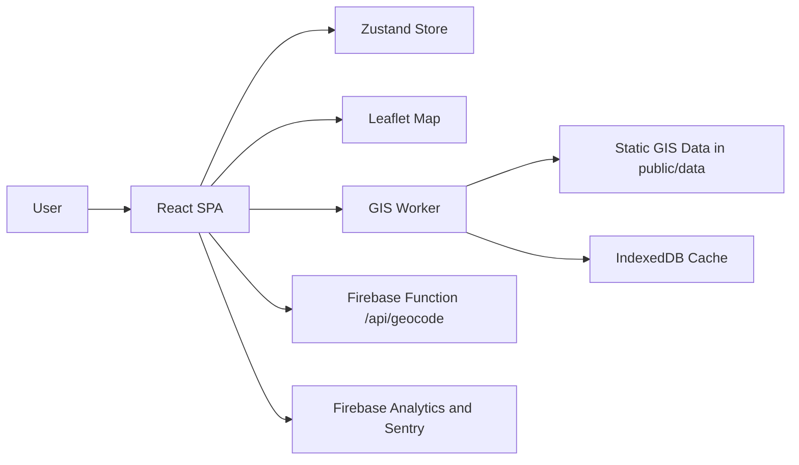

# Project Overview

## What This Project Does

NammaMap V2 is a Tamil Nadu civic GIS portal that helps users locate public services and administrative geographies on an interactive map. The application focuses on fast, local discovery for:

- Post offices and pincodes
- PDS ration shops
- TNEB section offices
- Health facilities
- Police jurisdictions
- Assembly and parliamentary constituencies
- Local bodies

## Main Features

| Feature | Evidence |
|---|---|
| Layer switching | `src/components/layout/Sidebar.tsx`, `src/store/useMapStore.ts` |
| Smart search and suggestions | `src/components/layout/SearchBar.tsx`, `src/hooks/useGisWorker.ts` |
| Map rendering | `src/features/map/GisMap.tsx` |
| District-aware routing | `src/components/routing/RouteManager.tsx` |
| Health filtering | `src/features/health/HealthFiltersPanel.tsx`, `src/features/health/HealthSummaryCard.tsx` |
| Local body discovery | `src/features/local_bodies_v2/components/LocalBodyV2Card.tsx` |
| PWA updates | `src/components/UpdateNotification.tsx`, `vite.config.ts` |
| SEO metadata | `src/App.tsx`, `src/components/SchemaData.tsx`, `public/robots.txt`, `public/sitemap.xml` |
| Analytics and error monitoring | `src/lib/firebase.ts`, `src/main.tsx` |

## Target Users

- Citizens looking for the nearest service office
- People searching by district, pincode, or landmark
- Support staff validating civic boundaries or office locations
- Content and operations teams maintaining Tamil Nadu GIS datasets

## Tech Stack

| Layer | Technologies |
|---|---|
| Frontend | React 19, TypeScript, Vite |
| Routing | React Router |
| State | Zustand |
| Map engine | Leaflet, react-leaflet, leaflet.markercluster |
| Worker search | Web Workers, RBush, Turf, TopoJSON |
| Caching | IndexedDB via `idb` |
| Telemetry | Firebase Analytics, Firebase Performance, Sentry |
| Deployment | Firebase Hosting, Firebase Functions |

## Architecture Summary

The frontend owns the UI, routing, and SEO tags. The Web Worker owns spatial indexing, search, and dataset resolution. Firebase Hosting serves the SPA and static assets, while the Cloud Function only proxies geocoding requests.

## High-Level Data Flow

1. The app boots in `src/main.tsx` and mounts `App`.
2. `RouteManager` synchronizes the URL with the active store state.
3. `useGisWorker` loads static datasets and posts worker commands.
4. The worker resolves locations against the GIS files in `public/data/`.
5. Results are stored in Zustand and rendered in map overlays and result cards.
6. SEO metadata is updated on the client with `react-helmet-async` and `SchemaData`.

