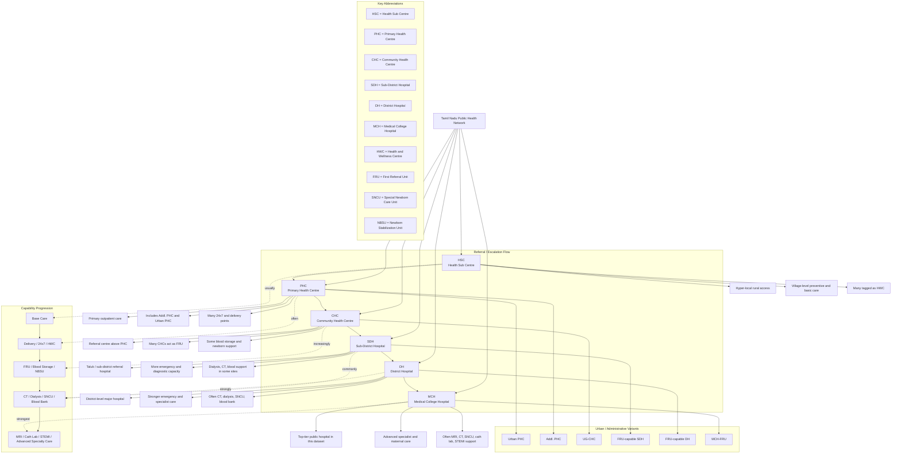

# Health Facilities Reference Chart

This chart summarizes the health facility hierarchy represented in the Tamil Nadu health dataset.

## Practical Reading Guide

- `HSC` and `PHC` are the broad population coverage network.
- `CHC` and `SDH` are the referral network.
- `DH` and `MCH` are the advanced hospital network.
- Capability intensity generally increases as you move from `HSC` to `MCH`.
